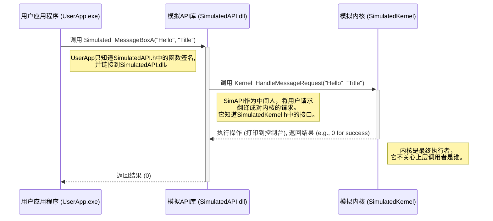

好的，收到您的指令。作为您的私人计算机科学教授，我非常欣赏您提出的这个任务。它不仅仅是一个编程练习，更是一次深入探索操作系统核心工作原理的绝佳机会，完全符合我们“探究第一性原理”的学习宗旨。

我们将模拟一个用户程序调用Windows API的过程。这能帮助我们直观地理解**用户态 (User Mode)** 与 **内核态 (Kernel Mode)** 的隔离、**API库 (如 KERNEL32.dll)** 作为中间桥梁的角色，以及**系统调用 (System Call)** 的抽象概念。

在编写任何代码之前，我为您精心准备了一份详细的项目规划文档。这份文档将作为我们后续开发的蓝图，确保每一步都清晰、有序。

---

## **项目规划文档：模拟Windows API调用与执行框架**

### **1. 项目概述 (Project Overview)**

#### **1.1 项目目标 (Objective)**
本项目旨在通过C语言，在您指定的开发环境中，构建一个教学性的、简化的模型。该模型将模拟一个用户应用程序 (User Application) 如何通过调用一个模拟的API库 (Dynamic Link Library, DLL)，来请求模拟的操作系统内核 (Simulated Kernel) 执行特定任务（例如：弹出一个消息框）。

#### **1.2 核心思想 (Core Idea)**
我们将把系统清晰地划分为三个独立但相互协作的组件：
1.  **用户应用程序 (`UserApp.exe`)**: 代表我们日常编写和运行的程序。
2.  **模拟API库 (`SimulatedAPI.dll`)**: 模仿 Windows 的 `kernel32.dll` 或 `user32.dll`。它为用户程序提供易于调用的函数接口，但其内部实现仅仅是“转发”请求。
3.  **模拟内核 (`SimulatedKernel`)**: 这是我们整个模拟系统的核心。它接收来自API库的请求，并“真正”执行操作。在我们的项目中，它将与用户程序在同一个进程中运行，但逻辑上是独立的，用以代表操作系统的内核功能。

#### **1.3 教学价值 (Educational Value)**
-   **理解API抽象层**: 明白为什么我们调用`MessageBoxA`就能看到窗口，而不是直接操作显卡。API库封装了复杂的底层操作。
-   **理解用户态/内核态隔离**: 尽管我们的模拟在同一进程中，但通过组件的划分，可以清晰地看到用户代码、API库代码、内核代码的职责分离。
-   **理解动态链接**: 学习如何创建和使用DLL，理解程序在运行时加载外部功能模块的机制。
-   **掌握模块化编程思想**: 将一个复杂的系统分解为低耦合、高内聚的模块，是所有大型工程项目的基础。

### **2. 技术栈与环境 (Technology Stack & Environment)**

-   **编程语言**: **C语言**。这是实现操作系统的首选语言，能让我们更贴近底层，精确控制内存和函数调用。
-   **编译器**: **GCC (MinGW-w64 UCRT64)**。这是您环境中指定的编译器，我们将完全基于它的特性和命令行工具。
-   **构建系统**: **Makefile**。对于一个多文件、多目标（一个`.exe`，一个`.dll`）的项目，使用`Makefile`是极其合适的。它能自动化编译和链接过程，清晰地定义文件间的依赖关系，是Linux/Unix环境下软件工程的基石，在Windows下通过MSYS2使用同样高效。我们暂时不需要CMake这样更复杂的系统。
-   **开发工具**: **Visual Studio Code**。
-   **操作系统**: **64位 Windows 10**。

### **3. 系统架构设计 (System Architecture Design)**

#### **3.1 核心组件文件结构**
我们的项目将由以下文件组成：

```
/project_root
|
|-- src/
|   |-- user_app/
|   |   `-- main.c               # 用户应用程序的源代码
|   |
|   |-- simulated_api/
|   |   |-- simulated_api.c      # 模拟API库的实现
|   |   `-- simulated_api.h      # 模拟API库的头文件，供UserApp包含
|   |
|   `-- simulated_kernel/
|       |-- simulated_kernel.c   # 模拟内核的实现
|       `-- simulated_kernel.h   # 模拟内核的头文件，供SimulatedAPI包含
|
`-- Makefile                     # 项目的构建脚本
```

#### **3.2 组件交互流程**
调用流程将严格遵循“用户 -> API -> 内核”的单向路径。



#### **3.3 "系统调用"的模拟 (Simulating the "System Call")**
在真实的操作系统中，从API库到内核的转换（即“系统调用”）是一个特殊的过程，它涉及从用户态到内核态的特权级切换。

在我们的模拟中，我们将这个过程**简化为一次普通的函数调用**。即 `SimulatedAPI.dll` 中的函数直接调用 `SimulatedKernel` 模块中的函数。这种简化能让我们聚焦于组件的逻辑划分和交互流程，同时我会在注释和文档中明确指出这与真实系统调用的区别。

### **4. 增量式框架搭建步骤 (Incremental Framework Construction Steps)**

我们将分阶段构建这个框架，确保每一步都有可验证的成果。

#### **步骤一：环境准备与 "Hello, Kernel!" (单一可执行文件)**
1.  **目标**: 验证我们的基本C代码和`Makefile`可以协同工作，实现最简单的跨文件函数调用。
2.  **操作**:
    -   创建 `src/user_app/main.c` 和 `src/simulated_kernel/simulated_kernel.c/.h`。
    -   在 `simulated_kernel.h` 中声明一个函数 `void Kernel_Bootstrap(void);`。
    -   在 `simulated_kernel.c` 中实现它，功能是打印一条消息，如 `"[Kernel] Simulated Kernel is running."`。
    -   在 `main.c` 中包含 `simulated_kernel.h` 并调用 `Kernel_Bootstrap()`。
    -   编写一个简单的 `Makefile`，将这两个 `.c` 文件编译并链接成一个名为 `user_app.exe` 的可执行文件。
3.  **产出**: 一个可以运行的 `user_app.exe`，执行后在控制台输出内核的启动信息。

#### **步骤二：引入API层 (逻辑分离)**
1.  **目标**: 将API层作为独立的逻辑模块插入到调用链中。
2.  **操作**:
    -   创建 `src/simulated_api/simulated_api.c/.h`。
    -   在 `simulated_api.h` 中声明 `void InitializeSystem(void);`。
    -   在 `simulated_api.c` 中实现 `InitializeSystem()`，其内部调用 `Kernel_Bootstrap()`。
    -   修改 `main.c`，不再直接包含内核头文件，而是包含 `simulated_api.h` 并调用 `InitializeSystem()`。
    -   更新 `Makefile`，使其能正确编译所有三个 `.c` 文件并链接成 `user_app.exe`。
3.  **产出**: `user_app.exe` 功能不变，但代码结构变为 `main.c -> simulated_api.c -> simulated_kernel.c`，调用链更加清晰。

#### **步骤三：构建真正的动态链接库 (DLL)**
1.  **目标**: 这是最关键的一步。将 `SimulatedAPI` 模块编译成一个真正的 `.dll` 文件，并让 `user_app.exe` 在运行时动态加载它。
2.  **操作**:
    -   修改 `Makefile`，增加一个新的构建目标。
    -   **DLL目标**: 使用GCC的 `-shared` 选项将 `simulated_api.c` 和 `simulated_kernel.c` 编译成 `simulated_api.dll`。（为简化起步，我们暂时将Kernel也编译进DLL，后续可分离）。
    -   **EXE目标**: `user_app.c` 在编译时需要链接到 `simulated_api.dll` 生成的导入库 (`.a` 文件)。
    -   我们需要在 `simulated_api.h` 中使用 `__declspec(dllexport)` 和 `__declspec(dllimport)` 来正确导出和导入DLL函数。
3.  **产出**:
    -   `user_app.exe` (可执行文件)
    -   `simulated_api.dll` (动态链接库)
    -   `libsimulated_api.a` (导入库，链接时使用)
    -   运行 `user_app.exe` 时，Windows加载器会自动找到并加载 `simulated_api.dll` 来执行相应功能。

#### **步骤四：实现第一个具体的API模拟 (`Simulated_MessageBoxA`)**
1.  **目标**: 在搭建好的框架上，实现一个有实际功能的API。
2.  **操作**:
    -   在 `simulated_kernel.h/.c` 中定义并实现 `void Kernel_HandleMessageRequest(const char* text, const char* caption);`，其功能是在控制台打印格式化的消息，模仿消息框。
    -   在 `simulated_api.h/.c` 中定义并实现 `int Simulated_MessageBoxA(void* hWnd, const char* lpText, const char* lpCaption, unsigned int uType);`。此函数将调用 `Kernel_HandleMessageRequest`。我们暂时忽略`hWnd`和`uType`参数。
    -   在 `main.c` 中调用 `Simulated_MessageBoxA(NULL, "This is a test message.", "Test Title", 0);`。
    -   更新 `Makefile` 并重新编译所有内容。
3.  **产出**: 运行 `user_app.exe`，控制台将输出类似下面的内容，成功模拟了一次API调用：
    ```
    +----------------------+
    | Test Title           |
    +----------------------+
    | This is a test message. |
    |       [ OK ]         |
    +----------------------+
    ```

### **5. 下一步计划 (Next Steps)**

当上述框架搭建完成后，我们可以基于它进行更深入的探索：
-   **模拟文件系统**: 在`SimulatedKernel`中用数据结构（如哈希表）模拟一个文件系统，并实现`Simulated_CreateFile`, `Simulated_WriteFile`等API。
-   **模拟句柄 (Handle)**: 在`SimulatedKernel`中维护一个句柄表，`Simulated_CreateFile`返回一个句柄（整数），后续操作凭句柄进行，这更接近真实OS的行为。
-   **错误处理**: 实现类似`GetLastError()`的机制。当API调用失败时，在内核中设置一个错误码，用户程序可以查询。

---

这份规划文档为您描绘了从零开始构建整个模拟框架的清晰路线图。我们将在接下来的交互中，严格按照这些步骤，一步一步地将这个系统从概念变为现实。

您对这份规划有任何疑问或想要调整的地方吗？如果没有，我们就可以从 **步骤一：环境准备与 "Hello, Kernel!"** 开始我们的实践了。