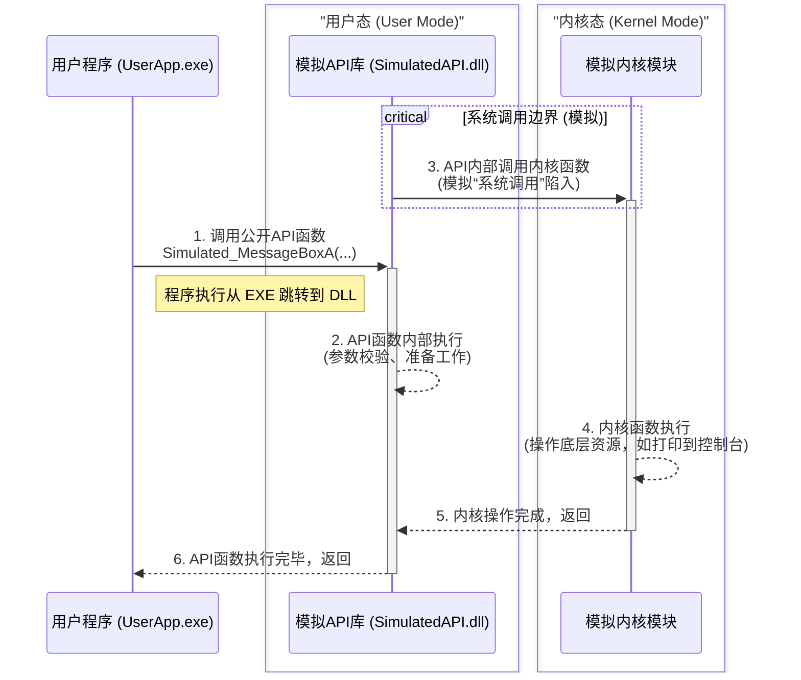

## **深入理解操作系统调用：从用户程序到内核的全流程解析**

### **面向对象与前言**

本文档面向正在学习《操作系统原理》、《计算机体系结构》等核心课程的计算机专业大学生。我们常常在书中学习到“系统调用”、“API”、“用户态”、“内核态”、“动态链接库(DLL)”等概念，但这些概念往往是孤立和抽象的。

本次，我们将以一个我们亲手编写的C语言项目为案例，通过一次模拟的`MessageBox`调用，将这些珍珠般散落的知识点串联成一条完整的项链。你将清晰地看到，当你在代码中写下一行简单的函数调用时，计算机内部究竟发生了一系列怎样精妙的连锁反应。

### **宏观视角：系统调用全景流程图**

在深入细节之前，我们先通过一个序列图来鸟瞰整个过程。这幅图是我们接下来所有讨论的总纲。



### **分步详解：一次API调用的生命周期**

现在，让我们跟随一次`Simulated_MessageBoxA`调用的旅程，一步步拆解图中的每一个环节。

#### **步骤一：用户程序的请求发起 (`main.c`)**

-   **发生了什么？**
    一切始于`user_app`中的`main`函数。作为应用程序的编写者，我们想要在屏幕上显示一个消息框。我们并不知道如何直接操作屏幕，但我们知道有一个叫`Simulated_MessageBoxA`的函数可以帮我们完成这个任务。于是，我们像调用一个普通函数一样调用了它。

-   **代码溯源 (`src/user_app/main.c`)**:
    ```c
    // 用户程序只知道这个函数的“签名”（名称、参数、返回值）
    // 这个签名来自于它包含的头文件 "simulated_api/simulated_api.h"
    Simulated_MessageBoxA(
        NULL, 
        "这是一条来自用户程序UserApp的测试消息。", 
        "用户程序消息", 
        0
    );
    ```

-   **核心概念解析：API (Application Programming Interface)**
    `Simulated_MessageBoxA`就是我们提供给用户程序的**API**。API是一份**契约**或**菜单**，它向外部世界承诺：“你只要按照我规定的格式（函数签名）来请求，我就能为你提供某项服务”。API的美妙之处在于**封装**，用户无需关心其内部复杂的实现细节。

-   **工程类比**:
    这好比您（客户）想盖一栋房子，您不需要知道钢筋怎么绑、混凝土怎么浇，您只需要拨打建筑公司项目经理（API）的公开电话，告诉他您的需求（传递参数）。

#### **步骤二：进入动态链接库 (`simulated_api.dll`)**

-   **发生了什么？**
    当`main`函数调用`Simulated_MessageBoxA`时，程序的执行控制权从`user_app.exe`的代码段，**跳转**到了被加载到同一进程地址空间中的`simulated_api.dll`的代码段。CPU开始执行`Simulated_MessageBoxA`函数在DLL中的具体实现。

-   **代码溯源 (`src/simulated_api/simulated_api.c`)**:
    ```c
    // 这是API函数的真正实现，位于DLL中
    SIM_API int Simulated_MessageBoxA(void* hWnd, const char* lpText, const char* lpCaption, unsigned int uType) {
        // ...
        printf("[模拟API] 收到消息框（MessageBox）请求。\n");
        // ...
        // 准备调用更底层的服务...
        Kernel_HandleMessageRequest(lpText, lpCaption);
        // ...
    }
    ```

-   **核心概念解析：DLL (Dynamic Link Library) 与动态链接**
    `simulated_api.dll`是一个独立于`.exe`的二进制文件。它在`.exe`运行时才被操作系统加载器“链接”进来。这种机制使得库的更新无需重新编译主程序，也允许多个程序共享同一个库，节省了内存和磁盘空间。我们通过`__declspec(dllexport)`将`Simulated_MessageBoxA`函数标记为“可供外部调用”，从而实现了这种链接。

-   **工程类比**:
    您的电话接通了，项目经理（API函数）开始处理您的请求。他首先在自己的办公室（DLL）里进行一些准备工作，比如记录您的需求、检查预算是否充足（参数校验）。

#### **步骤三：跨越边界——模拟“系统调用”**

-   **发生了什么？**
    API函数`Simulated_MessageBoxA`在完成了自己的准备工作后，调用了来自内核模块的函数`Kernel_HandleMessageRequest`。**这是整个流程中最核心的一步**。在我们的模拟中，这只是一次普通的函数调用。但在真实的操作系统中，这是一个特殊且受保护的过程。

-   **代码溯源 (`src/simulated_api/simulated_api.c`)**:
    ```c
    // API函数调用内核函数，跨越了逻辑上的边界
    Kernel_HandleMessageRequest(lpText, lpCaption);
    ```

-   **核心概念解析：用户态 (User Mode) vs. 内核态 (Kernel Mode) 与系统调用 (System Call)**
    -   **用户态**: 应用程序运行在用户态，权限受限。它不能直接访问硬件，也不能访问其他进程的内存，以防一个有bug或恶意的程序搞垮整个系统。我们的`UserApp.exe`和`SimulatedAPI.dll`都运行在用户态。
    -   **内核态**: 操作系统内核运行在内核态，拥有最高权限，可以执行任何CPU指令，访问任何内存和硬件。
    -   **系统调用**: 当用户程序需要执行一项它没权限做的操作（如读文件、创建窗口）时，它必须请求内核代为执行。这个请求的过程就叫**系统调用**。它通过一条特殊的CPU指令（如x86的`syscall`或`int 0x80`）触发，使CPU从用户态切换到内核态，然后跳转到内核中预设好的代码（系统调用处理程序）开始执行。
    -   **我们的模拟**: 我们用`SimulatedAPI`调用`Kernel`的普通函数，来**模拟**这个从用户态“陷入(trap)”内核态的过程。

-   **工程类比**:
    项目经理（API）不能自己去操作起重机（硬件）。他必须填写一份标准化的、受安监部门认可的“作业申请单”（系统调用），并提交给总工程师团队（内核）。这个提交过程本身就是一个受严格管控的流程（模式切换）。

#### **步骤四：内核空间的操作 (`simulated_kernel.c`)**

-   **发生了什么？**
    现在，执行权已经位于（模拟的）内核空间。`Kernel_HandleMessageRequest`函数开始执行。它拥有操作底层资源的“权限”（在我们的例子里，这个资源就是“控制台”）。它根据API层传递过来的参数，在控制台上精心“绘制”出消息框的边框、标题和内容。

-   **代码溯源 (`src/simulated_kernel/simulated_kernel.c`)**:
    ```c
    // 内核函数直接操作“底层资源”——控制台
    void Kernel_HandleMessageRequest(const char* text, const char* caption) {
        printf("[内核] 收到消息请求。正在渲染至控制台...\n");
        // ... 各种 printf 语句来“绘制”界面 ...
    }
    ```

-   **核心概念解析：内核 (Kernel)**
    内核是操作系统的核心，是计算机硬件的第一个、也是最高级的软件抽象层。它负责进程管理、内存管理、设备驱动等一切核心功能。它是系统稳定和安全的基石。

-   **工程类比**:
    总工程师团队（内核）收到了作业申请单，他们是唯一被授权可以操作起重机、挖掘机（硬件）的人。他们按照申请单的要求，精确地完成了吊装、挖掘等作业（在控制台打印）。

#### **步骤五与六：功成身退，逐层返回**

-   **发生了什么？**
    内核函数`Kernel_HandleMessageRequest`执行完毕后，通过`return`语句将控制权交还给它的调用者——API函数`Simulated_MessageBoxA`。接着，`Simulated_MessageBoxA`也执行完毕，同样通过`return`将控制权最终交还给`main`函数。`main`函数在API调用结束后，继续执行后续的指令。

-   **核心概念解析：调用栈 (Call Stack)**
    整个调用过程完美地诠释了函数调用栈的`LIFO (Last-In, First-Out)`特性。`main`调用`API`，`API`调用`Kernel`，函数栈帧层层压入；`Kernel`返回，`API`返回，`main`继续，函数栈帧再层层弹出。

-   **工程类比**:
    总工程师团队作业完成，向项目经理报告“已完工”。项目经理再打电话给客户您，告知“您的需求已满足”。整个流程闭环。

### **总结与升华**

通过这个简单的案例，我们亲手实现并观察了一次看似简单的API调用的完整旅程。这趟旅程穿越了用户态与内核态的边界，跨越了EXE与DLL的模块鸿沟，其背后是操作系统设计者为了实现**抽象**、**保护**和**复用**而建立的一整套精妙机制。

希望这份文档能帮助你和你身边的同学，将书本上的理论与实践代码真正地对应起来，从而更深刻地理解我们每天都在与之交互的、最伟大的软件——操作系统。